# Route Work Item Task

## Purpose

Quickly and accurately classify incoming work items (bugs, enhancements, features) and route them to the appropriate team and workflow within a federated repository structure. This ensures work flows efficiently to the right place without unnecessary delays or confusion.

## Task Instructions

### 1. Initial Work Item Assessment

#### Information Gathering

**Required Information:**
```markdown
Essential Details:
- [ ] Description of issue/request
- [ ] Reporter/requester identity
- [ ] Affected system/component
- [ ] Current behavior (if bug)
- [ ] Desired behavior
- [ ] Business impact/urgency

Helpful Context:
- [ ] Steps to reproduce (if bug)
- [ ] Screenshots/logs/examples
- [ ] Related tickets/issues
- [ ] Attempted workarounds
```

**If Information Missing:**
```
Template Response:
"To properly route this [issue/request], I need:
1. [Missing information]
2. [Why it's needed]

Please provide this so I can route to the right team quickly."
```

### 2. Classification Decision Tree

```mermaid
graph TD
    A[New Work Item] --> B{Is something broken?}
    B -->|Yes| C{Was it working before?}
    B -->|No| D{New capability?}
    C -->|Yes| E[🐛 BUG]
    C -->|No| F{Missing expected feature?}
    F -->|Yes| E
    F -->|No| G[Enhancement or Feature]
    D -->|Yes| H{Major change?}
    D -->|No| I{Improvement to existing?}
    H -->|Yes| J[✨ FEATURE]
    H -->|No| K[📈 ENHANCEMENT]
    I -->|Yes| K
    I -->|No| L[Needs Clarification]
```



#### Classification Criteria

**🐛 BUG - Defect in Existing Functionality**

Indicators:
- Something that was working is now broken
- Behavior differs from documentation
- System error or crash
- Data corruption or loss
- Security vulnerability
- Performance degradation

Examples:
```
✓ "Login button doesn't work on mobile"
✓ "API returns 500 error for valid requests"
✓ "Report shows incorrect calculations"
✓ "App crashes when uploading large files"
```

**📈 ENHANCEMENT - Minor Improvement**

Indicators:
- Small improvement to existing feature
- UI/UX refinement
- Performance optimization
- Additional option or parameter
- Better error message
- Documentation update

Examples:
```
✓ "Add sorting option to user list"
✓ "Improve error message clarity"
✓ "Add dark mode to settings page"
✓ "Increase upload size limit"
```

**✨ FEATURE - New Capability**

Indicators:
- Entirely new functionality
- Major workflow change
- New integration required
- Affects multiple teams
- Requires architectural decision
- Needs product strategy alignment

Examples:
```
✓ "Add AI-powered recommendations"
✓ "Implement SSO authentication"
✓ "Build mobile app version"
✓ "Create analytics dashboard"
```

### 3. Severity Assessment (For Bugs)

#### Severity Matrix

| Severity | Impact | Urgency | Response Time | Examples |
|----------|---------|---------|---------------|----------|
| 🔴 **Critical** | System down, data loss | Immediate | < 2 hours | Payment system failure, security breach |
| 🟠 **High** | Major feature broken | ASAP | < 24 hours | Can't login, core workflow blocked |
| 🟡 **Medium** | Feature impaired | Normal | Within sprint | Wrong calculation, UI glitch |
| 🟢 **Low** | Minor inconvenience | Low | As capacity allows | Typo, cosmetic issue |

#### Severity Decision Factors

```markdown
Assess Severity by answering:

1. User Impact:
   - How many users affected? (All/Many/Some/Few)
   - Can users work around it? (No/Difficult/Yes)
   - Is revenue impacted? (Yes/Potentially/No)

2. System Impact:
   - Data integrity at risk? (Yes/Potentially/No)
   - Security implications? (Yes/Potentially/No)
   - Performance impact? (Severe/Moderate/Minor/None)

3. Business Impact:
   - Customer facing? (Yes/No)
   - Compliance/legal issue? (Yes/No)
   - Reputation risk? (High/Medium/Low)

Scoring:
- Any "Yes" to data/security → Critical
- Revenue impact + No workaround → High
- Multiple "Moderate" impacts → Medium
- Otherwise → Low
```

### 4. Team Assignment

#### Team Identification Matrix

```markdown
Component → Team Mapping:

| Component/Area | Primary Team | Secondary Team | Escalation |
|----------------|--------------|----------------|------------|
| Mobile UI/UX | Mobile | UX | Mobile Lead |
| iOS specific | Mobile-iOS | Mobile | iOS Lead |
| Android specific | Mobile-Android | Mobile | Android Lead |
| Web frontend | Web | UX | Web Lead |
| Backend APIs | Backend | Architecture | Backend Lead |
| Authentication | Backend | Security | Security Lead |
| ML/AI features | AI | Backend | AI Lead |
| Data pipeline | Data | Backend | Data Lead |
| Infrastructure | DevOps | Backend | DevOps Lead |
| Database | Backend | DevOps | DB Admin |
| Integration | Integration | Backend | Architect |
```

#### Team Assignment Rules

```python
def assign_team(work_item):
    # Check explicit component mapping first
    if work_item.component in component_team_map:
        return component_team_map[work_item.component]

    # Check keywords for team assignment
    team_keywords = {
        'mobile': ['ios', 'android', 'app', 'mobile'],
        'web': ['browser', 'website', 'portal', 'webapp'],
        'backend': ['api', 'server', 'database', 'service'],
        'ai': ['ml', 'model', 'prediction', 'ai', 'training'],
        'devops': ['deployment', 'ci/cd', 'infrastructure', 'docker']
    }

    # Check for cross-cutting concerns
    if mentions_multiple_teams(work_item):
        return 'architecture'  # Architect reviews first

    # Default to most likely team based on description
    return identify_team_from_description(work_item)
```

#### Cross-Team Issues

When work spans multiple teams:

1. **Identify Lead Team** - Who owns the primary deliverable?
2. **Identify Supporting Teams** - Who needs to contribute?
3. **Assign to Lead** - With note about coordination needed
4. **Flag for Architecture Review** - If integration heavy
5. **Consider Mission Planning** - If truly cross-cutting feature

### 5. Workflow Routing

#### Routing Decisions

**Bug Workflow:**
```markdown
1. Classification: BUG confirmed
2. Severity: [Critical/High/Medium/Low]
3. Team: [Assigned team]
4. Action:
   - Critical → Page on-call, create incident
   - High → Add to team's current sprint
   - Medium → Add to team backlog, prioritize
   - Low → Add to backlog, address when able
```

**Enhancement Workflow:**
```markdown
1. Classification: ENHANCEMENT confirmed
2. Scope: Effort estimation (S/M/L)
3. Team: [Assigned team]
4. Action:
   - Small (< 1 day) → Team backlog
   - Medium (1-3 days) → Product backlog for prioritization
   - Large (> 3 days) → Needs product review
```

**Feature Workflow:**
```markdown
1. Classification: FEATURE confirmed
2. Scope: Multi-team impact assessment
3. Action:
   - Single team → Team product backlog
   - 2-3 teams → Architect review first
   - 3+ teams → Mission planning process
   - Strategic → Executive review required
```

### 6. Documentation & Communication

#### Routing Documentation

```markdown
# Work Item Routing Decision

**Item ID:** [Ticket/Issue number]
**Date:** [Current date]
**Routed By:** [Triage Master name]

## Classification
**Type:** [Bug/Enhancement/Feature]
**Severity/Priority:** [If applicable]
**Confidence:** [High/Medium/Low]

## Team Assignment
**Primary Team:** [Team name]
**Supporting Teams:** [If applicable]
**Rationale:** [Why this team]

## Routing
**Workflow:** [Bug tracking/Product backlog/Mission planning]
**Action Taken:** [Specific action]
**Next Steps:** [What happens next]

## Notes
[Any additional context or concerns]
```

#### Communication Templates

**To Reporter:**
```
Subject: [Type] - Your [issue/request] has been routed

Hi [Reporter],

Your [issue/request] regarding "[brief description]" has been classified as a [Bug/Enhancement/Feature] and routed to the [Team Name] team.

Classification: [Type]
Severity/Priority: [Level]
Expected Response: [Timeframe]
Tracking ID: [ID]

The team will review and provide updates through [channel].

Need to add information? Reply to this thread.
```

**To Assigned Team:**
```
Subject: New [Type] - [Brief Description]

Team [Name],

New [Bug/Enhancement/Feature] assigned to your team:

**Summary:** [Description]
**Reporter:** [Name]
**Severity:** [Level]
**Impact:** [Business impact]

**Triage Notes:**
[Why assigned to your team]
[Any special considerations]
[Dependencies noted]

**Recommended Action:**
[Suggested priority]
[Suggested approach]

Please acknowledge receipt and provide initial assessment.
```

### 7. Special Cases & Edge Cases

#### Ambiguous Items

When classification is unclear:

1. **Gather More Information**
   - Ask clarifying questions
   - Request examples
   - Get business context

2. **Default to Lower Classification**
   - Unclear if bug or enhancement → Enhancement
   - Unclear if enhancement or feature → Enhancement
   - Can always escalate later

3. **Use Spikes for Investigation**
   - Create investigation ticket
   - Time-box exploration
   - Then classify properly

#### Security Issues

```markdown
Security Issue Protocol:
1. NEVER include sensitive details in public channels
2. Immediately flag as Critical
3. Route to Security team first
4. Use secure communication channel
5. Limit access to need-to-know
6. Document in secure location only
```

#### Customer-Reported Issues

```markdown
Customer Issue Protocol:
1. Acknowledge within 2 hours
2. Default to higher severity
3. Include customer impact in routing
4. Flag for product team awareness
5. Set up customer communication plan
6. Track resolution closely
```

#### Technical Debt

```markdown
Technical Debt Items:
- Not user-visible bugs
- Code refactoring needs
- Architecture improvements
- Tool/library updates

Routing:
- Add to tech debt backlog
- Tag appropriately
- Consider batching into tech debt sprints
- Track accumulation over time
```

### 8. Routing Metrics & KPIs

Track routing effectiveness:

```markdown
Metrics to Track:

Accuracy Metrics:
- Correct initial classification rate (target: >90%)
- Correct team assignment rate (target: >85%)
- Re-routing rate (target: <10%)

Speed Metrics:
- Time to initial triage (target: <4 hours)
- Time to team acknowledgment (target: <24 hours)
- Critical bug response time (target: <2 hours)

Volume Metrics:
- Items triaged per day/week
- Distribution by type (bug/enhancement/feature)
- Distribution by team
- Distribution by severity

Quality Metrics:
- Reporter satisfaction with routing
- Team satisfaction with assignments
- Escalation rate
- Items needing clarification rate
```

### 9. Automation Opportunities

Consider automating:

```python
# Pseudo-code for automation rules

auto_routing_rules = [
    {
        'condition': 'title contains "crash" or "down"',
        'action': 'classify as bug, severity high'
    },
    {
        'condition': 'component == "mobile-ios"',
        'action': 'assign to mobile-ios team'
    },
    {
        'condition': 'reporter is customer',
        'action': 'flag for product review, increase priority'
    },
    {
        'condition': 'mentions multiple teams',
        'action': 'flag for architecture review'
    }
]

# But always allow human override
def route_work_item(item):
    auto_suggestion = apply_rules(item)
    if confidence(auto_suggestion) > 0.9:
        apply_routing(auto_suggestion)
        notify_human_for_review()
    else:
        escalate_to_human_triage()
```

### 10. Continuous Improvement

#### Regular Reviews

Weekly:
- Review re-routed items
- Identify pattern mismatches
- Update routing rules

Monthly:
- Analyze routing metrics
- Team feedback session
- Update documentation

Quarterly:
- Review classification criteria
- Update team mappings
- Refine automation rules

#### Feedback Loop

```markdown
Capture and Act on Feedback:

From Reporters:
- Was classification clear?
- Was routing timely?
- Were updates sufficient?

From Teams:
- Was assignment appropriate?
- Was severity accurate?
- Was context sufficient?

From Product:
- Are features identified early?
- Is business impact captured?
- Are priorities aligned?
```

## Quick Reference Card

### Classification Cheat Sheet

| Scenario | Classification |
|----------|----------------|
| "It used to work" | Bug |
| "It would be nice if" | Enhancement |
| "We need the ability to" | Feature |
| "This is broken" | Bug |
| "Can you add" | Enhancement/Feature |
| "Customers are asking for" | Feature |
| "Small tweak to" | Enhancement |
| "Completely new" | Feature |

### Team Assignment Quick Guide

| Keywords | Likely Team |
|----------|------------|
| UI, UX, interface, screen | Mobile/Web |
| API, endpoint, service | Backend |
| Database, query, data | Backend/Data |
| ML, AI, model, prediction | AI |
| Deploy, CI/CD, infrastructure | DevOps |
| Performance, scale | DevOps/Backend |
| Security, auth, permission | Security/Backend |

### Severity Quick Assessment

| Question | If Yes → |
|----------|----------|
| Data loss possible? | Critical |
| Security issue? | Critical |
| Revenue impacted? | High |
| Many users blocked? | High |
| Workaround exists? | Medium or Low |
| Cosmetic only? | Low |