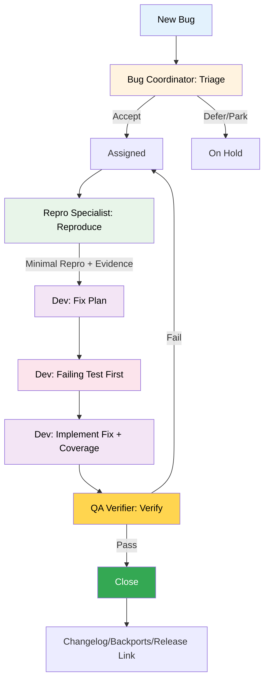

# BMAD Bug Management Expansion Pack

> Streamlined, standards-aligned bug reporting and resolution integrated with BMAD Core, QA gates, and Release Management.

---

## Overview

This pack delivers a consistent, traceable bug lifecycle for BMAD projects:

- Lifecycle: New → Assigned → In Progress → Verification → Closed (Reopen → In Progress)
- Reproducibility first, failing‑test‑first fixes, targeted regression checks
- YAML templates (same style as core story templates) for bug docs and plans
- Reuse core agents where it matters: `dev` for fixes, `qa` for gates
- Optional fast path to Release Management hotfix workflow for P0/P1

## When To Use

- You want standardized bug intake, triage, fix, and verification in BMAD repos
- You need a simple, documented place to store bug records and evidence
- You want QA gates applied when appropriate without heavy process overhead

## Storage & Templates

- Bug record: `docs/bugs/bug-<id>.md` (prefer your external tracker ID if you have one)
- Evidence: `docs/bugs/assets/<id>/` (screenshots, logs, HAR, crash reports)
- QA gate (optional): `docs/qa/gates/bug-<id>.yml`
- Templates (YAML): generated into the bug doc
  - `templates/bug-doc-tmpl.yaml` (full bug document)
  - `triage-notes-tmpl.yaml`, `repro-record-tmpl.yaml`, `fix-plan-tmpl.yaml`, `verification-plan-tmpl.yaml`, `rca-tmpl.yaml`, `bug-closure-tmpl.yaml`

## Agents & Commands (Quick Reference)

- Bug Coordinator — Nguyễn Thị Bình (`bug-coordinator`)
  - `*report-bug`, `*triage-bug`, `*close-bug`, `*rca`
- Repro Specialist — Triệu Thị Trinh (`repro-specialist`)
  - `*reproduce-bug`
- QA Verifier — Bùi Thị Xuân (`qa-verifier`)
  - `*verify-bug`, `*gate-update` (wraps core QA)
- Reuse core agents
  - Dev (`dev`): runs fix tasks guided by templates — `*task fix-plan`, `*task resolve-bug`, `*task coverage-check`
  - QA (`qa`): `*trace`, `*nfr`, `*review`, `*gate` (optional gate writing)

## What’s Included

- Agents: Bug Coordinator, Repro Specialist, QA Verifier (reuse core Dev)
- Workflows: `bug-lifecycle.yaml`, `hotfix-bug.yaml`
- Tasks: report-bug, triage-bug, reproduce-bug, fix-plan, resolve-bug, coverage-check, verify-bug, gate-update, close-bug, rca-and-prevention
- Templates (YAML): bug-doc, triage-notes, repro-record, fix-plan, verification-plan, rca, bug-closure
- Checklists: triage, reproduction, fix, verification, closure
- Data/KB: severity-priority rubric, repro guide, testing levels for bugs, RCA catalog

See `building-plan.md` for milestones and `pack-building-proposal.md` for design.

## Quick Start

```bash
# Activate agents as needed
*agent bug-coordinator
*agent repro-specialist
*agent qa-verifier

# Standard lifecycle
*workflow bug-lifecycle

# Or run tasks explicitly
@bug-coordinator *report-bug
@bug-coordinator *triage-bug
@repro-specialist *reproduce-bug
@dev  # write failing test first, then fix
@qa-verifier *verify-bug
@bug-coordinator *close-bug
```

## Installation

- Add this pack folder under `expansion-packs/` of your project.
- From your project root, run BMAD installer and select this pack:
  - `npx bmad-method install`
  - Choose “Install BMAD Core + Expansion Packs” and select “Bug Management”.
  - Re-run to refresh after changes.

## Bug Lifecycle (Mermaid)



## Comprehensive Flow (with QA Gate + Hotfix Handoff)

```mermaid
graph TD
  subgraph Intake
    A[Report Bug] --> B[Triage]
  end
  subgraph Build
    C[Reproduce] --> D[Fix Plan]
    D --> E[Failing Test First]
    E --> F[Fix + Targeted Regression]
  end
  subgraph Verification
    F --> G[Verify]
    G -->|Optional| H[Core QA: review + gate]
  end
  subgraph Outcome
    G -->|Pass| I[Close]
    H -->|FAIL/CONCERNS| C
    G -->|Fail| C
  end
  I --> J[Release Link + Changelog + Backports]
  B -->|P0/P1| K[Hotfix Workflow (Release Pack)]
  K --> J
```

## Usage Guide

- Create the bug document with `*report-bug` and keep it as the single source of truth.
- Use `*triage-bug` to dedupe, set Severity/Priority (with SLA), and assign ownership.
- Reproduce with evidence using `*reproduce-bug` and minimize the repro.
- Dev fills the Fix Plan, writes a failing test first, implements the fix, and adds targeted regression.
- QA Verifier runs `*verify-bug`; optionally use core `@qa *review` and `@qa *gate` for a formal gate.
- Close with `*close-bug`, linking commits/PRs, QA gate, and release/hotfix as needed.

## Suggested Scenarios (3)

1) Standard Sprint Bug (non‑production)
- Goal: Fix a routine bug during a sprint
- Run: `*workflow bug-lifecycle`
- Steps:
  - `@bug-coordinator *report-bug` → create bug doc using YAML template
  - `@bug-coordinator *triage-bug` → set S/P, owner, SLA
  - `@repro-specialist *reproduce-bug` → minimal repro + evidence
  - `@dev` → fill Fix Plan, write failing test first, implement fix, run `*task coverage-check`
  - `@qa-verifier *verify-bug` → targeted regression; link QA gate if used
  - `@bug-coordinator *close-bug`

2) P0 Production Hotfix
- Goal: Resolve an outage or critical production bug fast
- Run: `*workflow hotfix-bug`
- Steps:
  - Rapid report+triage → confirm P0/P1, assign owner
  - Minimal repro and evidence
  - Dev: short Fix Plan → failing test first → fix → critical coverage
  - QA Verifier: critical verification + optional gate
  - Handoff to Release: link to Release Management `hotfix-release`; then `*close-bug`

3) Hard‑to‑Reproduce Intermittent Issue
- Goal: Stabilize and gather enough signal to fix or defer
- Run: tasks individually (no workflow) to iterate quickly
- Steps:
  - `@bug-coordinator *report-bug` with best available info
  - `@repro-specialist *reproduce-bug` → focus on environment capture and logs; add tracing toggles per `data/repro-guide.md`
  - If still not deterministic: mark Decision=Park or Defer with clear SLA and telemetry plan in Triage Notes; keep evidence in `docs/bugs/assets/<id>/`
 - When repro becomes reliable, proceed with normal fix/verify/close

## Commands Reference

- Bug Coordinator: `*report-bug`, `*triage-bug`, `*close-bug`, `*rca`
- Repro Specialist: `*reproduce-bug`
- QA Verifier: `*verify-bug`, `*gate-update`
- Dev (core): `*task fix-plan`, `*task resolve-bug`, `*task coverage-check`
- Core QA (optional): `*trace`, `*nfr`, `*review`, `*gate`

## Artifacts

- Bug document: `docs/bugs/bug-<id>.md`
- Evidence: `docs/bugs/assets/<id>/`
- Optional QA gate: `docs/qa/gates/bug-<id>.yml`
- RCA in bug doc; metrics optional per team

## Best Practices

- Always write a failing test first to lock in the repro.
- Keep fixes minimal; avoid opportunistic refactors.
- Add targeted regression only for impacted paths.
- Use gates for high-risk production fixes or critical components.
- Link everything: PRs/commits, gate, release/hotfix, backports.

---

MIT License
